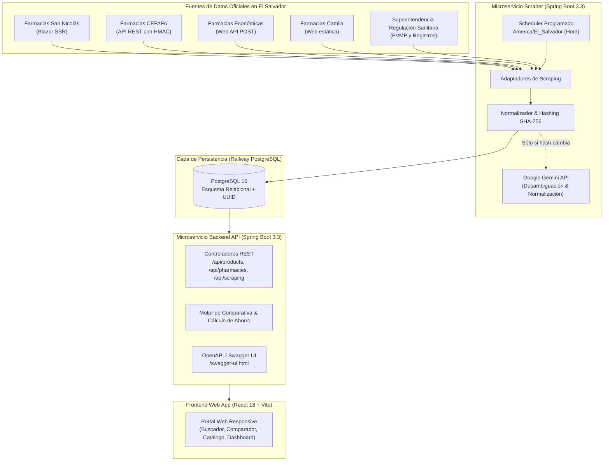

# 🏛️ Arquitectura del Sistema

El **Comparador de Precios de Medicamentos — El Salvador** está diseñado siguiendo una arquitectura de microservicios contenerizados y desacoplados, listos para despliegue automatizado en Railway.

---

## 📐 Diagrama de Arquitectura

---

## 🧩 Componentes

### 1. Backend REST API (`backend/`)
- **Framework**: Spring Boot 3.3.3, Java 17.
- **Persistencia**: Spring Data JPA + Hibernate con PostgreSQL y migraciones Flyway.
- **Documentación**: Springdoc OpenAPI / Swagger (`/swagger-ui.html`).
- **Seguridad**: Configuración CORS para el frontend de Vite y dominios de Railway.
- **Endpoints clave**:
  - `GET /api/products`: Catálogo paginado con filtros.
  - `GET /api/products/search?q={query}`: Búsqueda rápida.
  - `GET /api/products/{id}/comparison`: Comparación detallada de precios por farmacia, referencias SRS, cálculo de diferencia vs PVMP y sustitutos equivalentes.
  - `GET /api/pharmacies`: Directorio de farmacias.
  - `GET /api/scraping/status` y `POST /api/scraping/trigger`: Monitoreo y control manual.

### 2. Scraper & Scheduler Service (`scraper-service/`)
- **Framework**: Spring Boot 3.3.3, Java 17.
- **Orquestación**: Spring `@Scheduled` con zona horaria `America/El_Salvador` (cron: `0 0 8-17 * * *`).
- **Técnicas de extracción**:
  - **CEFAFA**: Firma HMAC-SHA256 en encabezados HTTP (`X-App-Key`, `X-Timestamp`, `X-Signature`).
  - **Económicas**: Peticiones JSON POST a `ObtenerArticulosPorNombre`.
  - **San Nicolás**: Parser HTML con Jsoup sobre tarjetas Blazor.
  - **Camila**: Adaptador con SSL flexible y fallback controlado.
  - **SRS**: Proveedor de registros sanitarios y Precios Máximos de Venta al Público (PVMP).
- **Control de Costos de IA**:
  - `ContentHashService`: Si el hash SHA-256 del contenido crudo no cambia, se reutiliza el resultado previo sin invocar a Gemini.

### 3. Frontend Web App (`frontend/`)
- **Stack**: React 18, TypeScript, Vite, React Router v6, Lucide React, Recharts.
- **Diseño**: Paleta institucional médica salvadoreña (`#112A46`, `#19A7A0`, `#2F9E6E`), tipografía *Plus Jakarta Sans*, 100% responsive para móviles, tablets y escritorio.
- **Vistas**:
  - **Home**: Buscador principal, KPIs generales, farmacias monitoreadas y productos destacados.
  - **Comparador**: Ficha del medicamento, banner regulatorio oficial de la SRS, tabla comparativa con ahorro vs PVMP, gráfico histórico con Recharts y alternativas genéricas/de marca.
  - **Catálogo**: Directorio filtrable por principio activo, presentación y ordenamiento por precio.
  - **Panel de Control**: Monitor de ejecuciones de scrapers y botón de disparo manual.

### 4. Base de Datos PostgreSQL (`database/`)
- Alojada en Railway.
- Tablas particionadas lógicamente entre catálogo maestro, productos por farmacia, histórico inmutable de precios, referencias regulatorias SRS y auditoría.
